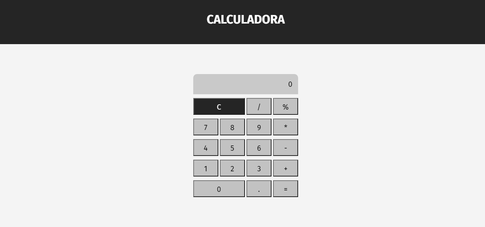
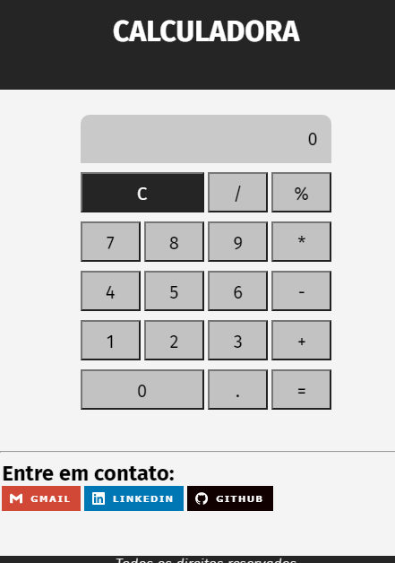
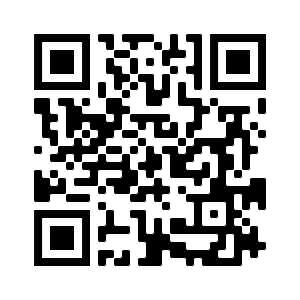

<<<<<<< HEAD
<h1>🖐 Olá, tudo bem?   <em>🖐 Hello, how are you? </em></h1> 
<h4>Este e um projeto de calculadora simples em JavaScript, ela ainda não está 100%. Pretendo adicionar um histórico de operações feitas e adicionar KeyboardEvent também. Mas espero que goste de como está ficando, fique a vontade para olhar. 

 
<em>This is a project of a basic calculator build in JavaScript, it isn't 100%. I intend to add a history of operations and add keyboard events too. But, i hope you like it and feel free to take a look.</em>
</h4>

### 📸 Algumas fotos do projeto:   <em>📸 Some pictures of the project:</em>
 
=======
<h1>🖐 Olá, tudo bem?   <em>🖐 Hello, how are you?</em></h1> 
<h4>Este e um projeto de calculadora simples em JavaScript, ela ainda não está 100%. Pretendo adicionar um histórico de operações feitas e adicionar KeyboardEvent também. Mas espero que goste de como está ficando, fique a vontade para olhar.    <em>This is a project of a basic calculator made with JavaScript, he's not 100% yet. 
    I intend to add a history of operations made and KyboardEvents as well. But, I hope you like and feel free to take a look.</em></h4>

### 📸 Algumas fotos do projeto:   📸 Some pictures of the project: 
>>>>>>> 9d20a826271e2d93f95bd6e0c88b78f07ae8720a

    
    

 

<<<<<<< HEAD
### Link do projeto e QR Code para você poder visualizar:   <em>Link of the project and QR code for you to view:</em>
### <a href="https://hugocamposarimathea.github.io/calculadora/">👉 Clique aqui para ir ao site 👈   <em>👉 Click here to go 👈</em></a>
=======
### Link do projeto e QR Code para você poder visualizar:   Link of the project and QR Code for you to view: 
### <a href="https://hugocamposarimathea.github.io/calculadora/"> 👉🏽 Clique aqui para ir ao site 👈🏽   👉🏽 Click here to go 👈🏽</a>
>>>>>>> 9d20a826271e2d93f95bd6e0c88b78f07ae8720a

<<<<<<< HEAD
 

### 📧 Quer entrar em contato comigo?   <em>📧 Some ways to contact me:</em>
 
=======
### 📧 Quer entrar em contato comigo?   📧 If you want to talk to me, send me an e-mail:
>>>>>>> 9d20a826271e2d93f95bd6e0c88b78f07ae8720a

    
     

